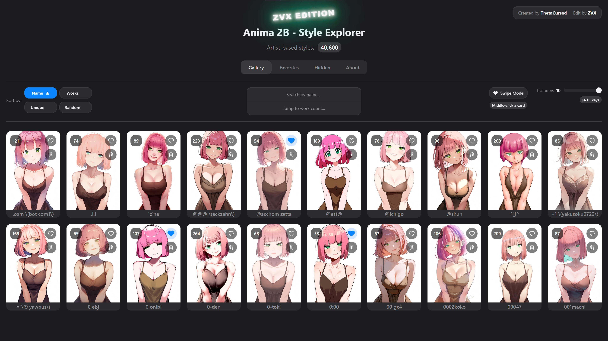
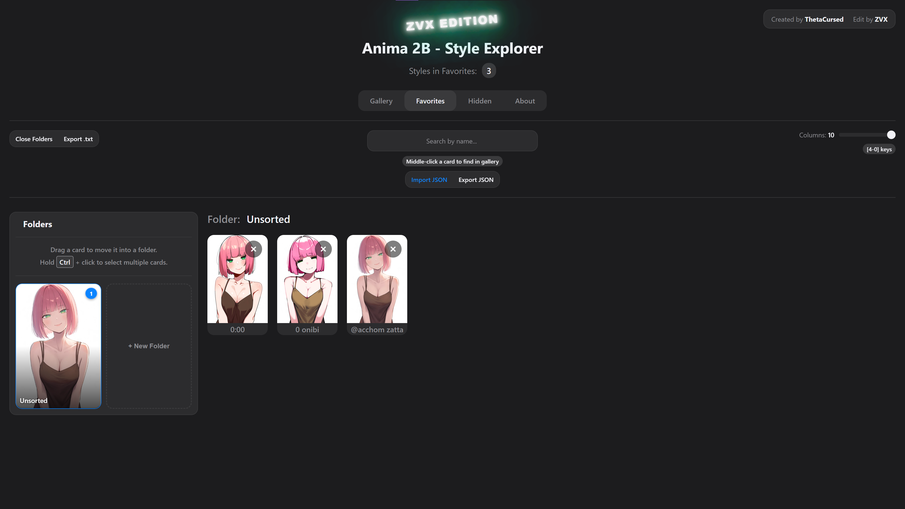
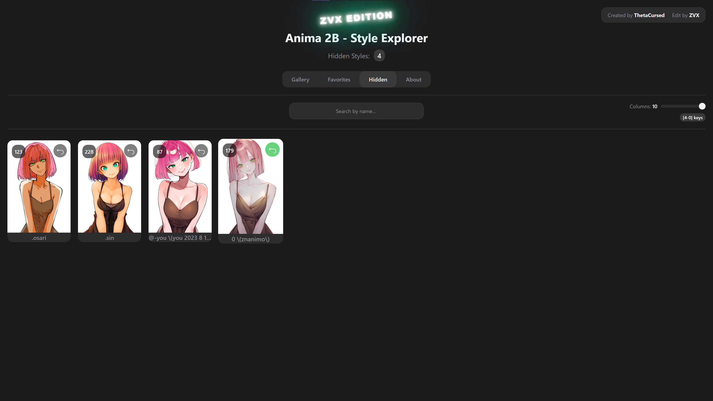

# Anima 2B Style Explorer 🎨 — ZVX Edition (Clean & Free)

An interactive, high-performance visual database designed to explore artist styles within the **Anima 2B parameter model**

## 🚀 ZVX Edition
* **100% Offline & Local:** Runs completely on your local PC with no internet connection required.
* **Fully Free:** Removed all monetization.
* **Artist Hiding:** Instantly hide any artist from the main list to clean up your workspace.
* **Hidden Archive Tab:** Dedicated tab to view and manage all your hidden artists.
* **Quick Restore:** Easily unhide and bring any artist back to the main view with one click.
* **Swipe Mode Mouse Scroll:** Enabled mouse wheel scrolling directly within the Swipe Mode.

  
  
  

## 🚀 Overview
The **Anima 2B Style Explorer** is a specialized tool for AI artists and prompt engineers. It provides a standardized way to benchmark how the **Anima 2B model** (by CircleStone Labs) interprets specific artist influences from the **Danbooru** dataset.

Instead of guessing, you can now visually verify every style before you hit "Generate".

## ✨ Current Status: Goal Achieved!
- **Massive Library:** Now featuring over 40,000 danbooru-tagged artist previews.
- **No Restrictions:** Run locally or on any domain without anti-piracy or donation triggers blocking your view.

## 🛠️ Key Features
* **Visual Search & Filtering:** Instantly search over 40,000 styles by name. Jump directly to artists based on their dataset size (`Works`) or their **Uniqueness Rank**.
* **Advanced Sorting:** Organize artists alphabetically (`A-Z`), by the number of training images (`Works`), or by their stylistic **Uniqueness** to find hidden gems.
* **Favorites Management:** Save your favorite artists with a single click. Your collection is stored locally in your browser via IndexedDB.
* **Folder Organization:** Group your favorite artists into custom folders with drag-and-drop. Select and move multiple artists at once (`Ctrl+Click`), filter your view, and export folder-specific lists.
* **Import & Export:** Easily back up your favorites to a `.json` file or export a simple `.txt` list of artist names for your notes.
* **Customizable Layout:** Adjust the gallery grid from 4 to 10 columns using a slider or keyboard hotkeys (`4`-`0`) for a personalized viewing experience.
* **One-Click Copy:** Click on any artist card to instantly copy the name to your clipboard, ready to be pasted into your prompt.
* **Focused Swipe Mode:**
    * Enter a distraction-free, one-by-one viewing mode that automatically skips artists already in your favorites.
    * **Start Anywhere:** Launch from the beginning, or middle-click any card to start from that point.
    * **Continue Sessions:** Middle-click a card in your Favorites to jump back to the gallery and resume swiping where you left off.
    * **Hotkeys:** Navigate with `←`/`→`, favorite with `↓`, and copy names with `C`.
* **High Performance & Offline Use:** Built with lightweight Vanilla JS and optimized WebP images for blazing-fast speed. The entire app can be downloaded and run offline.

## 💻 Technical Stack
- **Core Model:** Anima 2B
- **Tagging System:** Danbooru-based
- **Frontend:** HTML5, CSS3 (Modern Flexbox/Grid), Vanilla JavaScript

## 🤝 Acknowledgments & Credits
- **ThetaCursed** for the original concept and application structure.
- **ZVX** for code cleanup, removing domain-locking functions, and removing timed donation popups.
- **CircleStone Labs** for the incredible Anima 2B model.
- The **Danbooru** community for the comprehensive tagging ecosystem.

## 📄 License
This project is an open-source visual guide for educational and artistic reference purposes. Distributed under the **MIT License** (see the `LICENSE` file for details).
